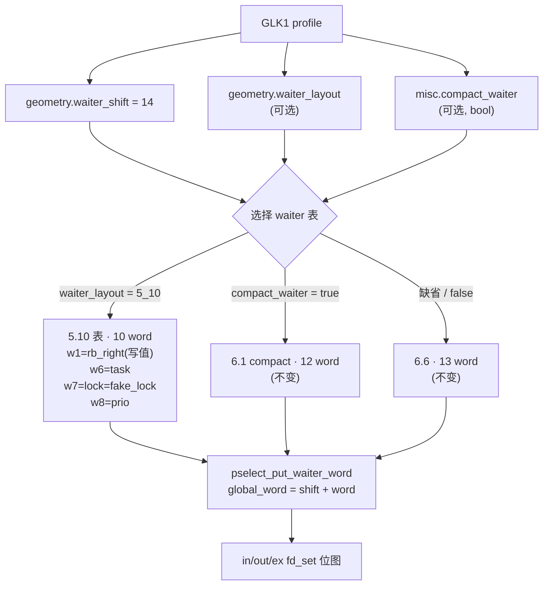

# 5.10 waiter 映射 计划（2026-10-05）

L 级改动（route 攻击路径 + wire/profile 字段 + Native↔Kotlin 契约）。

## 现状与基线

- 分支 / commit：`very-not-stable-dev` @ `123a469`
- `select_stack_route.cpp` 的 pselect waiter 字段表按 `layout.compact_waiter` 二分：
  - `compact == true`  → 6.1 compact（12 word）
  - `compact == false` → 6.6 非 compact（13 word）
- 5.10 的 `rt_mutex_waiter` 是**第三种形状**：10 word，`sizeof == 0x50`，只有
  `tree_entry` / `pi_tree_entry` 两个 rb_node，无 hrtimer、无 `wake_state`。
- 后果：当前 A53 profile 落到 6.6 分支，会往 10 word 结构里写第 13 个 word
  （`wake_state`），该字段在 5.10 不存在。这是**必然 panic**，不是概率问题。
- 已推导并落档的输入：`a53/docs/ROUTE-GEOMETRY-5.10.md`（`waiter_shift = 14`）、
  `a53/docs/WRITE-PRIMITIVE-5.10.md`（写原语、10 word 表、`rt_mutex` 0x20）。

## 目标与非目标

目标：为 `select_stack` 增加第三张 waiter 映射表（5.10），由 profile 显式选择，
不影响 6.1 / 6.6 两条既有路径。

非目标：

- 不改写原语侧。伪造 `struct rt_mutex` 的偏移（`0x08` / `0x10` / `0x18`）与
  `util.cpp:346` 已验证的一致，**lock 侧不需要任何 5.10 改动**。
- 不新增格式版本号（规范禁止）。v2 用「键是否出现」表达 presence，新增可选字段
  不需要升版。
- 不改 `compact_waiter` 的语义。它保持 bool，仍是「6.1 compact」的开关。
- 不动 TCP / multicast 两条 route。

## 改动清单

| 文件 | 改动 | 理由 |
|---|---|---|
| `src/core/profile/model.h` | route 扩展节新增 `std::optional<uint8_t> waiter_layout` | 三态需要独立于 `compact_waiter` 的选择位 |
| `src/core/profile/binary.cpp` | 新增 `OPT("waiter_layout", geometry.waiter_layout)` | v2 字段表；键名须与 Kotlin 逐字一致 |
| `src/core/route/select_stack_route.cpp` | 三分支：legacy(`compact_waiter`) / 显式 `waiter_layout` | 缺省保持旧行为，避免既有 profile 漂移 |
| `app/.../AndroidProfileConfigController.kt` | `entries()` / `apply()` / `from()` 同步该键 | 双侧一致性由测试强制 |
| `app/.../FieldLabels.kt` | 字段标签 | UI 一致性 |
| `src/core/tests/*` | 三态选择的 host 测试 | 新行为必须有单测 |

## 数据流/控制流差异

不变量：

1. **缺省行为逐字节不变。** 未携带 `waiter_layout` 的 profile 必须走原分支。
2. `waiter_shift` 与表的选择相互独立（本批次不合并）。
3. 5.10 表的 word 1（`rb_right`）是写值，word 7（`lock`）是伪造 `rt_mutex`
   指针；其余为 0 / `fake_task` / `prio = 1`。
4. 10 word 表不得写出 `waiter + 0x50` 以外的偏移。

## 兼容性与回滚

- 兼容：字段可选，缺省即旧行为。60 份既有 profile 不受影响。
- 回滚：`git checkout` 上表 6 个文件。无持久化状态。

## 验证矩阵

| # | 命令 | 预期 |
|---|---|---|
| 1 | `make -C src ghostlock API=34` | 0 warning，且产物与本批次前逐字节相同 |
| 2 | `make -C src ghostlock API=34 EXTRA_CXXFLAGS=-DGHOSTLOCK_TARGET_A53_5_10` | 0 warning |
| 3 | `python3 tools/cmp_disasm.py <base> <new>` | 仅 `select_stack` 相关函数出现**已复核的注解差异**（新增分支）；race 五函数仍 strict IDENTICAL |
| 4 | `make -C src native-host-tests` | 全通过 |
| 5 | `route_catalog_test` + Kotlin `RouteCatalogAgreementTest` | 双侧一致 |
| 6 | `make -C src lint-tidy` | 0 findings |
| 7 | 真机门禁 | 未执行，见下 |

第 3 项与既有地址布局批次不同：那里要求 8 函数 strict IDENTICAL，本批次
**预期** `do_one_write` / `run_main_route_threads` 出现差异，因为 waiter 表选择
进入了攻击路径。按规范这属于「已复核的注解差异」，需逐条确认新增分支只在
表选择处、不改变既有 6.1 / 6.6 路径的指令序列。

第 7 项仍不可执行：无 A53 真机在 bench，且 5.10 的插入侧接受条件
（PI walk 的 `prio` / colour 比较）只能在活树上观察。

## 明确保留

- 插入侧接受条件：5.10 表的 `prio = 1` 与 colour `RB_RED` 是**按 6.6 表类比**
  填的，尚未在 5.10 上验证。若 PI walk 因此拒绝该节点，表现为「race 无写入」
  而非崩溃。这是已知未验证项，不得在真机门禁记录里写成已验证。
- `kernel_phys_load` / `kernel_phys_offset`：仍未知，DT 不在 `boot.img` 内，
  无法静态导出。direct-map alias 在 5.10 上未验证。

## 进度

- [x] 现状与基线
- [x] 目标与非目标
- [x] 形状确认：5.10 表为 10 word，`sizeof(rt_mutex_waiter) == 0x50`
- [x] lock 侧无需改动：`rt_mutex` 偏移 `0x08` / `0x10` / `0x18` 已由
      `util.cpp:346` 与 `remove_waiter` 反汇编双向确认，与家族无关
- [x] 写值语义确认：写值 = 被删节点的 `rb_right`（`WRITE-PRIMITIVE-5.10.md`）
- [x] colour / `prio` 不约束提取侧（写入发生在 `rb_erase` 之前）
- [ ] **改动清单落地 —— 已回滚，原因见下**
- [ ] 验证矩阵
- [ ] 真机门禁

### 回滚原因（2026-10-05）

`waiter_layout` 字段的 native 侧管线（`model.h` / `binary.cpp`）一度接入，随即回滚。
原因是发现**表的 word 取值无法在不猜测的前提下确定**：

5.10 的写入是 `*(lock + 0x10) = node->rb_right`。要让这次写入落到
`request->target`，需要 `lock == target - 0x10`；但既有 6.1 / 6.6 两张表都把
`lock` 填成 `fake_lock`（payload 内地址），其写入落在 payload 页内。既有路线
**如何**把这个 payload 相对地址变成真正的内核写，本次没有确定——它依赖 6.x 上
`__rb_erase_color` 内部 `parent->rb_child = child` 的修复分支，而那段代码需要
6.x 内核的静态符号才能读。

在没有 `vmlxml`、也没有真机的情况下填写 word 取值，就是把「已验证」伪装成
「已推导」。按规范不把猜测合入，因此回滚到已验证状态。

半接入的字段同样不留：只加 native 侧会让 Kotlin `entries()` 无法输出该键，
双侧一致性测试随即失败，且 Gradle 在本机不可用、无法同步验证。