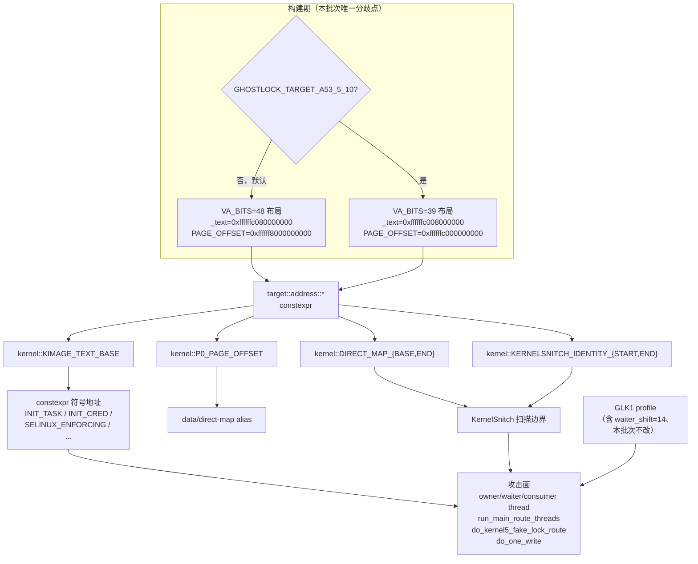

# A53 VA_BITS=39 地址布局 计划（2026-10-05）

L 级改动（攻击关键路径 + 公共数据结构）。本计划补记于代码之后，属流程补正：实现先行，
计划随后补齐并据其回溯验证结论。

## 现状与基线

- 分支 / commit：`very-not-stable-dev` @ `123a469`
- 现状：`src/core/kernel/target_constants.hpp` 只含一套 VA_BITS=48（GKI 6.12）地址布局，
  且 `kImageTextBase` 经 `constexpr` 链在编译期烘进 `INIT_TASK` / `INIT_CRED` /
  `selinux_enforcing` 等全部符号地址。
- 已知问题：目标机 `SM-A536E` / `5.10.237-android12-9-31999025-abA536EXXSMGZE2` 为
  `CONFIG_ARM64_VA_BITS=39`，`_text = 0xffffffc008000000`。直接套用 6.12 布局时
  `INIT_CRED` 会算成 `0xffffffc081c12020`，与真值 `0xffffffc009c12020` 差 `0x78000000`，
  地址解析阶段即失败，任何写原语都到不了。

基线二进制：`/tmp/opencode/ghostlock.baseline`（本批次改动前）。

## 目标与约束

目标：为 VA_BITS=39 家族提供一套编译期地址布局，使 A53 的符号地址可解析。

非目标（明确不做）：

- 不做运行期可切换布局。`kImageTextBase` 进入 `constexpr` 链，要运行期化就得把整条攻击面
  的地址读取改成运行期读取，远超本批次范围，且会同时改动 60 份既有 profile 的回归面。
- 不改 GLK1/wire 格式，不新增配置版本号（规范明令禁止）。
- 不改 Kotlin 侧。地址布局是构建期选择，不进 profile。
- 不动 `route` 的 waiter 字段映射（另立批次，见「明确保留」）。
- 不动 `kernelsnitch/`。

## 改动清单

| 文件 | 改动 | 理由 |
|---|---|---|
| `src/core/kernel/target_constants.hpp` | `address` 命名空间按 `GHOSTLOCK_TARGET_A53_5_10` 二选一；6.12 专属 `static_assert` 改为按家族分支，A53 分支新增自身 pin 与跨布局不变量 | VA_BITS 决定 `PAGE_OFFSET` 与 `_text` 落点，是构建期常量，不应运行期判断 |
| `src/core/kernel/target_constants.hpp` | 新增不变量：`kPageOffset == kDirectMapBase`、`kKernelSnitchIdentityStart == kDirectMapBase`、`kKernelSnitchIdentityEnd < kDirectMapEnd` 在两家族均成立 | 防止两套布局混用 |
| `src/Makefile` | 新增 `EXTRA_CXXFLAGS`，串到 `CXXFLAGS` | 唯一需要的构建入口，不污染默认路径 |
| `src/core/tests/target_constants_test.cpp` | 地址 pin 按家族分支；A53 分支新增 span 与「image base > PAGE_OFFSET」不变量 | 让测试对两套布局都是真门禁，而非只钉死 6.12 |

## 数据流/控制流差异

地址只在一个方向流动：构建期常量 → 符号地址 → 攻击面。



不变量：

1. **默认构建产物必须与改动前逐字节相同。** 已验证（`cmp`）。
2. **race / route 五个攻击函数必须 strict IDENTICAL。** 布局只该出现在常量物化处。
3. `do_one_write` 只允许出现「布局派生阈值」这一个立即数差异，且指令序列与分支目标不变。
4. `apply_iomem_cache` 的 `span >= DIRECT_MAP_END - DIRECT_MAP_BASE` 守卫不得被削弱。

## 兼容性与回滚

- 兼容：默认构建无宏，行为与产物完全不变，60 份既有 profile 与设备不受影响。
- 回滚：`git checkout src/core/kernel/target_constants.hpp src/core/tests/target_constants_test.cpp src/Makefile`。
  无数据迁移、无持久化状态。

## 验证矩阵

| # | 命令 | 预期 | 实测 |
|---|---|---|---|
| 1 | `make -C src ghostlock API=34` | 默认构建 0 warning | 0 warning |
| 2 | `cmp` 默认产物 vs 基线 | 逐字节相同 | IDENTICAL |
| 3 | `make -C src ghostlock API=34 EXTRA_CXXFLAGS=-DGHOSTLOCK_TARGET_A53_5_10` | 0 warning | 0 warning |
| 4 | `python3 tools/cmp_disasm.py <default> <a53>` | 5 函数 strict IDENTICAL；`do_one_write` 仅常量阈值差异 | 符合，见下 |
| 5 | `make -C src native-host-tests` | 全通过 | 13/13 通过（`tcp_zerocopy` 因 x86 host 无法汇编 ARM `yield`，为改动前既有问题） |
| 6 | `target_constants_test` 两家族 | 各自编译 0 error 且 RUN PASS | 均 PASS |
| 7 | `address_space_test` 两家族 | 均 PASS | 均 PASS |
| 8 | `make -C src lint-tidy` | 0 findings | 0 unsuppressed findings |
| 9 | 真机门禁 | 冷机、固定 CPU 对、单 route、KernelSU 未加载 | **未执行**，见下 |

第 4 项实测明细：

```
IDENTICAL owner_thread (69 instructions, strict)
IDENTICAL waiter_thread (891 instructions, strict)
IDENTICAL consumer_thread (179 instructions, strict)
IDENTICAL run_main_route_threads (413 instructions, strict)
IDENTICAL do_kernel5_fake_lock_route (173 instructions, strict)
SHAPE-DIFF do_one_write (126 instructions)
  [14] base: mov x9, #-0x7fffffffff   // 布局派生阈值
  [14] cur:  mov x9, #-0x3fffffffff
```

`do_one_write` 的差异经逐条比对确认为**唯一一个立即数**，`[15] cmp` / `[16] b.lo` /
`[17] adrp` / `[18] ldr` / `[19] cmp` / `[20] b.ls` 全部同序同目标，属「已复核的注解差异」：
该阈值由内核 VA 区间宽度导出，而 VA 区间宽度正是本批次要改的东西。

第 9 项未执行：本机无 A53 真机连接，且真机门禁按规范要求 route 与写验证全部命中才算通过，
而 5.10 waiter 映射尚未落地（另立批次），此刻跑门禁只会得到必然失败的结果。

## 明确保留

- `select_stack_route.cpp` 的 waiter 字段映射：5.10 是第三种形状（10 word，无 hrtimer、
  无 `wake_state`），与现有 6.1 `compact` / 6.6 两张表都不匹配，需另立 L 级批次。
  本批次只提供 `waiter_shift = 14`（已由 Image 推导，见 `a53/docs/ROUTE-GEOMETRY-5.10.md`）。
- `profile/binary.cpp` / Kotlin route config：字段表与键名本批次零改动，双侧一致性不受影响。
- 5.10 的 `kernel_phys_load` / `kernel_phys_offset`：仍未知，保持缺省，不猜测。

## 进度

- [x] 现状与基线确认
- [x] 目标与非目标界定
- [x] 改动清单落地（4 个文件）
- [x] 跨布局不变量 `static_assert`
- [x] 构建矩阵（两家族各 0 warning）
- [x] 默认产物逐字节回归（IDENTICAL）
- [x] `cmp_disasm` 8 函数复核（5 strict + 1 已复核注解差异）
- [x] host 单测 13/13 + 两家族 `target_constants_test` / `address_space_test`
- [x] `lint-tidy` 0 findings
- [x] 修正自身缺陷：DirectMap/Identity span 与注释不符（1 GiB / 512 MiB → 64 GiB / 8 GiB）
- [x] 修正自身缺陷：`target_constants_test` 中两条 A53 断言写错（越界 1 的不等号、写反的 `2^63`）
- [ ] 真机门禁（依赖 waiter 映射批次）